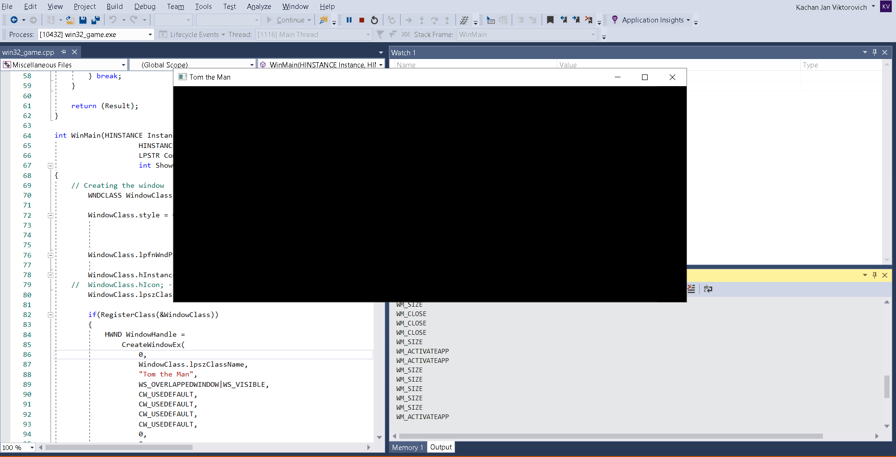

# 2D_game_in_C

Welcome to the gigantic project on creating a complete 2D game from scratch using C and some C++ features on top without using any libraries whatsoever. 🎉🎉🎉

The project structure is quite simple. In the main folder we have folders for code, data and misc which is kind of a place for the settings and stuff. 

In the build.bat described the steps on what happens after the compilation. Long story short, after the compilation we produce a bunch of stuff including the .exe file and some debugging stuff and it spits it out to the outer folder which is called build outside the main game folder.

For compilation I use the Visual Studio 2017 compiler.

Here's the first message box that I got from the game: 

Congratulations! We are definitely on our way to create the best 2D adventure game out there!

Implemented the window which redraws itself with white and black as you resize it:

White:

And black:

